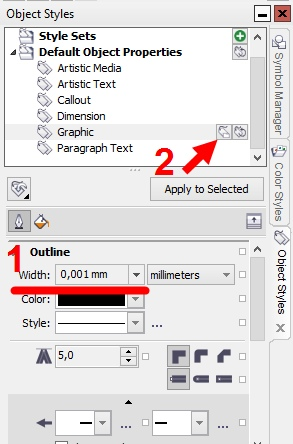

# Как настроить новый документ

Как сделать так, чтобы в новом документе всё было настроено, как нам надо?

Часть настроек можно задавать через стили.  

Например, как выставить толщину абриса. Заходим в докер стилей \(*Window - Dockers - Object Styles*\), выбираем *Graphic* \(то есть вся графика, кроме тех видов объектов, которые перечислены рядом\), задаём свойства абриса и жмём маленькую кнопку *Save as new document default*.

